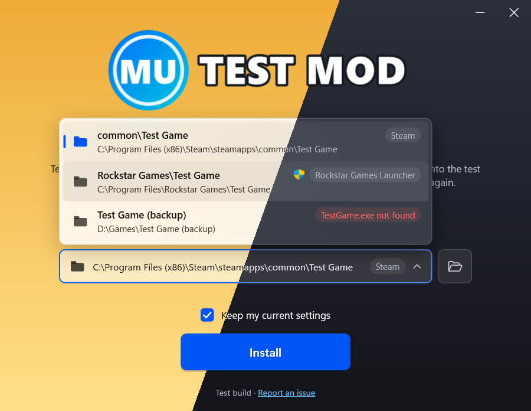

modupdater
===================

**modupdater** allows to update asi plugins and to install mods.

- **Updater**: plugins that link the library check for new releases when the game starts (GitHub releases or direct download links), download them and install them while the game is running. A standalone `modupdater.asi` updates every plugin that has an `UpdateUrl` in its version resource.
- **Installer**: an executable that downloads a mod (web installer) or carries it inside (offline installer) and installs it into the game folder found through Steam, the Rockstar Games Launcher or a folder of your choice. Two user interfaces: the classic TaskDialog one and a modern, high-DPI aware window with your logo, colors and fonts.

>3 different methods of replacing ini files: **replace all and keep settings**, **replace all and discard settings** and **don't replace**.

----------


----------

## Building

Requires Visual Studio 2026.

```
premake5.bat     :: generates build\modupdater.slnx and build\test.slnx
builddist.bat    :: builds dist\libmodupdater_{release,debug}_{win32,x64}.lib
runtests.bat     :: builds everything and runs the automated tests (runtests.bat Debug Win32 Zip Http)
updatedeps.bat   :: rebuilds zlib, curl and cpr in source\external (updatedeps.bat -Latest for the newest releases)
```

The libraries in `source\external` are built from their official source releases by `updatedeps.bat`, with the CMake of Visual Studio: static libraries with the static CRT and no other dependencies, optimized for size and without debug information. curl only has HTTP and HTTPS through the TLS of Windows (Schannel), zlib only what reading and writing zip archives needs. `source\external\deps.json` pins the versions and the SHA-256 of their sources; `-Latest` looks up the newest releases on GitHub and pins them. Afterwards run `runtests.bat` and `builddist.bat`.

## Library

Include `dist/libmodupdater.h` and link `dist/libmodupdater_<configuration>_<platform>.lib`. All strings are UTF-8, `hModule` is the module that calls the function:

```cpp
HMODULE hm = NULL;
GetModuleHandleExW(GET_MODULE_HANDLE_EX_FLAG_FROM_ADDRESS | GET_MODULE_HANDLE_EX_FLAG_UNCHANGED_REFCOUNT, (LPCWSTR)&DllMain, &hm);
```

### Updater

```cpp
muSetUpdateURL(hm, "https://github.com/User/Repo/releases/latest/download/Mod.zip"); // or a GitHub repository page
//muSetDevUpdateURL(hm, "...");         // alternative source, the newer file wins
//muSetArchivePassword(hm, "...");
//muSetSkipUpdateCompleteDialog(hm, true);
//muSetLogFile(hm, "modupdater.log");
muInit();
```

Several plugins in the same process share one update check and one dialog. Files that are in use (the loaded plugin itself) are renamed to `*.deleteonnextlaunch` and removed on the next start. Errors (download failed, file locked by the game...) are shown instead of a success message.

### Installer

```cpp
int main(int argc, char** argv)
{
    if (muAppendZipFile(argc, argv))    // "installer.exe mod.zip [output.exe]" creates an offline installer
        return 0;

    muSetInstallerIcon(hm, LoadIconW(hm, MAKEINTRESOURCEW(101)));
    muSetInstallerWindowTitle(hm, "My Mod");
    muSetInstallerMainInstruction(hm, "Choose where to install My Mod");
    muSetInstallerContent(hm, "Description with <a href=\"https://example.com\">links</a>.");
    muSetInstallerFooter(hm, "<a href=\"https://github.com/User/Repo\">GitHub</a>");
    muSetSteamAppID(hm, "12210", "GTAIV");                   // Steam AppID (or game name) + subfolder
    muSetRGLAppID(hm, "Grand Theft Auto IV", "");            // Rockstar Games Launcher
    muSetInstallerGameExecutable(hm, "GTAIV.exe;EFLC.exe;PlayGTAIV.exe"); // any of them marks the game folder, "Launch" button
    muSetUpdateURL(hm, "https://github.com/User/Repo/releases/latest/download/Mod.zip");
    return muRunInstaller();                                 // or muInitInstaller()
}
```

The installer checks the folder (game executable, write permission, running game), restarts itself as administrator when needed and continues with the same folder, checks the free disk space, resumes interrupted downloads, never writes outside of the chosen folder, can be cancelled at any time and shows what went wrong with a link to its log (`%TEMP%\<installer>.log`).

#### Modern user interface



```cpp
muSetInstallerUI(hm, MU_UI_MODERN);
muSetInstallerLogoResource(hm, MAKEINTRESOURCEA(102), "PNG");    // or muSetInstallerLogo(hm, data, size)
muSetInstallerColor(hm, MU_COLOR_BUTTON, RGB(0xE0, 0x2F, 0x3A));

// light and dark theme: the installer follows the Windows app mode, each theme can have its own look
muSetInstallerThemeGradient(hm, MU_THEME_DARK, RGB(0x1E, 0x22, 0x2C), RGB(0x08, 0x09, 0x0C));
muSetInstallerThemeColor(hm, MU_THEME_DARK, MU_COLOR_LINK, RGB(0x00, 0xDC, 0xDC));
muSetInstallerThemeLogoResource(hm, MU_THEME_LIGHT, MAKEINTRESOURCEA(103), "PNG"); // logo that works on a light background
```

| Function | |
| --- | --- |
| `muSetInstallerLogo[Resource]` | logo (PNG, JPEG, BMP, GIF, ICO, TIFF), the icon is used when there is none |
| `muSetInstallerBackground[Resource]`, `muSetInstallerBackgroundOverlay` | background image under the gradient, overlay opacity in percent |
| `muSetInstallerGradient`, `muSetInstallerColor` | gradient, text, links, buttons, progress bar, panels, list, error and success colors (`MU_COLOR_*`); unset colors match the brightness of the gradient |
| `muSetInstallerTheme` | `MU_THEME_AUTO` (default) follows the Windows light/dark app mode, also when it changes while the installer is open; `MU_THEME_LIGHT`, `MU_THEME_DARK` |
| `muSetInstallerThemeColor`, `muSetInstallerThemeGradient`, `muSetInstallerThemeLogo[Resource]` | colors and logo for `MU_THEME_LIGHT` or `MU_THEME_DARK` only, settings without a theme are used by both |
| `muSetInstallerFont`, `muSetInstallerFontData` | font family, optionally a private TTF/OTF from memory |
| `muSetInstallerWindowSize` | window size in 96 DPI pixels, the height fits the content by default |
| `muSetInstallerString` | replaces any built-in text (`MU_STR_*`), e.g. for translations; `MU_STR_HEADING` "" hides the title under the logo |
| `muSetInstallerIniMode` | ini handling, optionally as a "Keep my current settings" option |
| `muAddInstallerPath` | more suggested install folders |

The install location box opens a list of the suggested folders (Steam, Rockstar Games Launcher, `muAddInstallerPath`, the installer's own folder) with their source, a warning when the game executable is missing and a shield when installing there needs administrator rights; the folder button next to it opens the folder picker. Paths are always shown in full, long ones wrap at folder separators. The window follows per-monitor DPI changes, can be dragged by its background, used with the keyboard (Tab, arrows, Enter, Esc) and shows the progress on the taskbar. The classic UI gets the same features where TaskDialog allows it.

#### Offline installers

`installer.exe mod.zip` creates `installer_with_mod.exe` (`installer.exe mod.zip output.exe` to choose the name). Several archives can be appended one after another. The result can be code signed afterwards; appending to a signed executable removes the old signature so that it can be signed again.

#### Command line

| | |
| --- | --- |
| `--mu-install-dir=<folder>` | install into this folder |
| `--mu-silent` | no user interface, exit code `MU_INSTALL_*` |
| `--mu-ui=classic\|modern` | overrides `muSetInstallerUI` |
| `--mu-theme=auto\|light\|dark` | overrides `muSetInstallerTheme` |
| `--mu-ini=merge\|replace\|skip` | overrides `muSetInstallerIniMode` |
| `--mu-screenshot=<file.png>` | saves a picture of the modern UI instead of showing it, with `--mu-screenshot-page=main\|locations\|tooltip\|progress\|success\|failure\|cancelled` and `--mu-screenshot-dpi=144`; the folders found on this PC appear in it |

## Tests

- `bin\<platform>\<configuration>\UnitTests.exe` - automated tests (zip handling, zip slip, signed offline installers, downloads with a local test server, resume, cancel, GitHub API, ini merging, files in use, silent installs...); `UnitTests.exe Online` (or `runtests.bat Release x64 Online`) also checks HTTPS downloads from GitHub
- `TestInstallerApp.exe` - run it without arguments to pick a scenario and the light, dark or automatic theme: modern/classic UI, online/offline installer, custom styles, many install locations, slow download, download error, updater, screenshots of all pages
- `TestApp.exe` - a "game" with two plugins that update themselves from a local server

## Standalone plugin

`modupdaterx86.asi`/`modupdaterx86_64.asi` checks every file in the game folder for an `UpdateUrl`/`DevUpdateUrl` value in its version resource. `modupdater.ini`:

```ini
[MODS]
SomePlugin.asi = https://github.com/User/Repo         ; update URL for files without one, also installs missing files
[SomePlugin.asi]
Password = secret                                    ; archive password
[DATE]
UpdateFrequencyInHours = 6
[MISC]
SkipUpdateCompleteDialog = 0
OutputLogToFile = 1
[DEBUG]
AlwaysUpdate = 0
Token =                                              ; GitHub token, only sent to github.com
```
